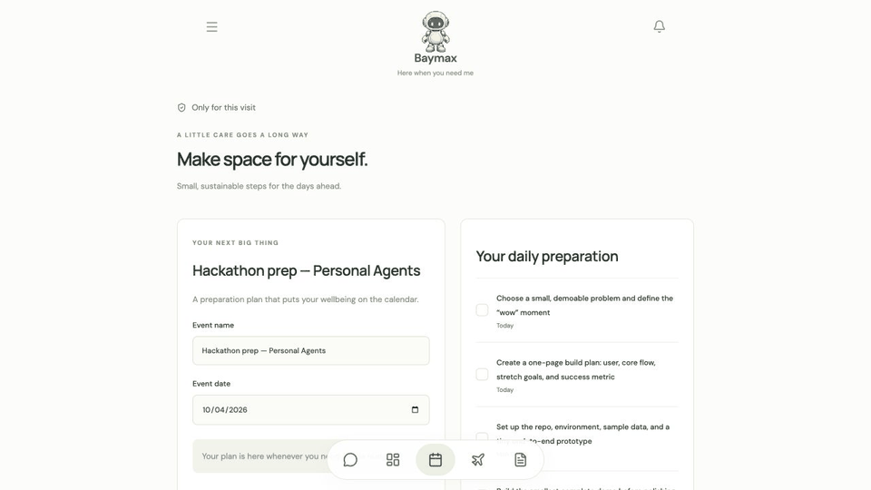
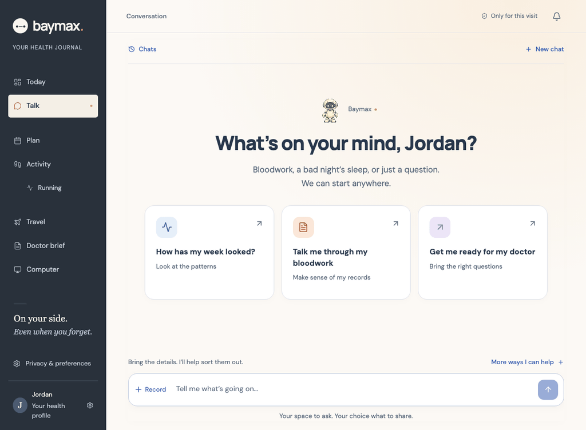
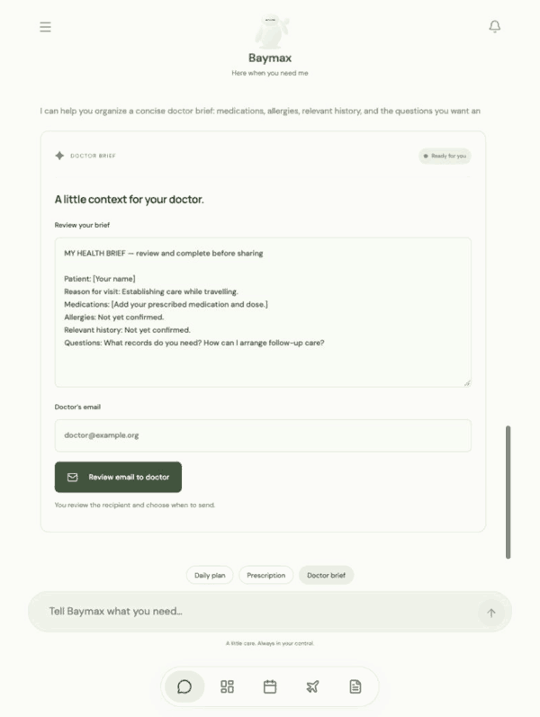
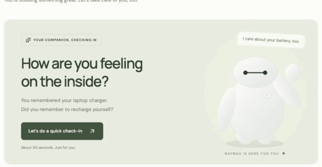

# BayMax - Medical Personal Agent

> **An adorable Medical Personal Agent that cares for you, designed to be secure and compliant.**

**Build Personal Agents Hackathon Project Submission**

Baymax is a privacy-first personal medical assistant that helps you take care of yourself before health becomes an emergency. It remembers what matters, nudges you to follow through, and helps you carry your health context wherever life takes you.

## UI walkthroughs

A conversation-first care companion built with **Assistant UI**, React, TypeScript, and Vite. Baymax surfaces interactive care cards inside the chat, with a centered animated mascot, a pill composer, and bottom navigation.

### Prepare for a hackathon

Plan your date, check off small wins, and complete a daily energy check-in without leaving the conversation.



### Prescription concierge

Open **Shopping demo** in the chat quick actions to try a sample prescription cart. Choose between two fictional pharmacies, adjust the pack count, review the total, and confirm a simulated order. Pharmacy names, prices, availability, and medication details are illustrative. No prescription is verified, no payment is collected, and no order is sent.

A diabetes medication refill **order preview** with a visible workflow, professional verification requirements, and review controls. No medication is purchased or prescribed by this frontend.



### Email a doctor brief

Edit the brief in chat, enter a recipient, and review the email before opening a draft in your email app. The user sends the email there; server-side delivery is not implemented.



### Our 2D companion

SVG animation with gentle breathing, waving, and blinking. Respects reduced-motion preferences.



## Run locally

Requires Node.js 22+.

```bash
npm ci
cp .env.example .env
# Fill in DATABASE_URL and Neon AI Gateway values in .env.
npm run db:migrate
npm run agent:dev
# In a second terminal:
npm run dev
```

Open the local URL Vite prints. Vite proxies `/api`, `/travel`, `/health`, and `/care-state` to Mastra on port 4111. Enable **Remember across visits** during onboarding or in Privacy & preferences to save your care space. A successful save is shown above the page heading.

The ignored `.env` is server-only. `DATABASE_URL` powers the workspace store; `NEON_AI_GATEWAY_TOKEN` and `NEON_AI_GATEWAY_BASE_URL` power the existing `neon/gpt-5-6-luna` agent. Auth and S3 variables are reserved for future login/uploads and are not used by the browser-bound persistence implementation. Saving uses an HttpOnly cookie, so separate browser profiles have separate workspaces. There is no account login or cross-device sync.

`npm run db:migrate` creates only the additive `baymax_care_workspaces` table and its monotonic revision sequence and is safe to rerun. The UI loads saved state before accepting changes, serializes saves, and rejects stale revisions. Turning off memory deletes the remote copy; Delete my care space also clears the conversation and returns to onboarding. Unsaved changes stay in memory and show a retry action on failure; they are never copied into localStorage.

```bash
npm test
npm run build
# Stop agent:dev before building its production output.
npm run agent:build
# Set APP_ORIGIN in .env to the exact preview URL, e.g. http://localhost:4173.
npm run agent:start
# In a second terminal:
npm run preview
```

## Implemented frontend

- Conversation-first Assistant UI runtime streaming live Mastra responses through Neon AI Gateway.
- Generative UI rendered through `makeAssistantToolUI` and tool-call message parts.
- Agent-generated care plan and doctor brief contents populate editable cards and their corresponding pages.
- Editable inline care plans and travel checklists.
- Prescription order preview with review and confirmation states.
- Doctor brief editing, recipient validation, email review, and `mailto:` handoff.
- Daily check-ins, hydration logging, movement tasks, and preferences.
- Optional Neon persistence for profile, check-ins, hydration, movement/weekly overview, tasks, plans, travel context and generated checklist, brief/email draft, preferences, and conversation including tool results.
- Clear restore/save errors, retry controls, optimistic revisions, and user-controlled deletion.
- Mobile and desktop layouts, keyboard-accessible dialogs, and reduced-motion support.

## Sponsor integration status

| Sponsor | Status |
| --- | --- |
| Assistant UI | Implemented: runtime, message primitives, composer, suggestions, tool UI |
| Mastra | Implemented: live agent text and care plan/doctor brief tool results |
| Neon | Implemented: consent-based browser workspace and conversation persistence, plus AI Gateway |
| Exa | Next: source-backed travel and pharmacy research |
| Fly.io | Dockerfile, Nginx config, and starter Fly configuration included; not deployed |

The app has live LLM and database connections. Pharmacy fulfilment, payment, server-side email delivery, web research, and background notifications remain unimplemented. The GIFs use fictional details.

## Fly.io deployment preparation

The included Dockerfile builds the Vite frontend and serves it on port 8080. It is still a frontend-only deployment: run the Mastra backend separately and configure the frontend reverse proxy for `/api`, `/travel`, `/health`, and `/care-state` before deployment. Set server-side `APP_ORIGIN` to the exact public frontend origin so cookies are Secure and write origins are validated. No deployment or billing action has been performed.

## The idea

You have an assistant for work. Why not one for your health?

Baymax is the caring, persistent companion that checks in on your habits, helps you prepare for busy weeks, and makes navigating healthcare while travelling less overwhelming.

## Focus areas

- **Preventative care:** reminders for appointments, checkups, and follow-ups based on your care plan.
- **Lifestyle:**
  - **Exercise:** achievable movement goals, activity check-ins, and gentle accountability.
  - **Diet:** meal planning, habit tracking, and reminders aligned with your preferences and goals.
- **Personal context:** a health profile and memory that you control.

## Use cases

- **Proactive care:** support for exercise and diet through achievable goals, meal planning, and gentle reminders.
- **Prescription meds ordering:** identify where to buy prescribed medication and help order it for you. Research and ordering are planned capabilities; the current prototype provides an order preview.
- **Medical brief for new doctors when travelling:** prepare a concise health summary to review and share with a new doctor.

### 1. Proactive care: exercise and diet

BayMax helps you build everyday exercise and diet habits with achievable movement goals, meal planning, activity check-ins, and gentle accountability. Reminders should be adjustable, snoozable, and easy to turn off.

For a busy week or hackathon, it can help you plan a routine around sleep, meals, hydration, movement, and your existing medication schedule.

### 2. Prescription meds ordering

Travelling and running low on your prescribed medication? Baymax helps you prepare a medication summary, research local prescription requirements and pharmacy options, and identify questions to ask a licensed clinician or pharmacist.

It supports the process; it does not issue prescriptions, authorize purchases, or recommend medication substitutions.

### 3. Briefing a new doctor while travelling

Baymax drafts a concise, user-reviewed health brief containing the information you choose to share: current medications, allergies, relevant history, recent concerns, and questions for your appointment.

Review it, edit it, and share it with your new doctor so you do not have to start from zero.

## Privacy first. HIPAA compliance as a design goal.

Health information deserves deliberate protection. Our goal is a HIPAA-compliant, privacy-first product.

**This hackathon project is a prototype with live backend connections. HIPAA compliance has not been verified. Use synthetic data for demos.**

Implemented persistence safeguards: explicit storage consent, server-only credentials, hashed random browser session IDs, HttpOnly/SameSite cookies (Secure on HTTPS), write-origin checks, bounded schema validation, parameterized queries, revision checks, and remote deletion.

The new health tools and `/health` endpoints inherited from main still use shared, synthetic in-memory sample data; the saved browser workspace is separate from that demo store. Restoring a workspace preserves its saved check-in, hydration, and weekly overview instead of replacing them with demo values.

Account authentication, access audit logging, cross-device access, file upload, export of the entire workspace, and compliance review remain future work. Further safeguards include:

- Explicit consent for storing health information and sharing it with external services.
- Data minimization and user-controlled memory.
- Encryption in transit and at rest.
- Authentication, access controls, and audit logging.
- User options to review, export, and delete stored information.
- Keeping identifiable health information out of public repositories, application logs, and web-search queries.
- Reviewing vendor agreements, data flows, and deployment requirements before handling real protected health information.

## Sponsors and stack we aim to use

Assistant UI, Mastra, and Neon are connected. See the integration status above for remaining work. These are not claims of confirmed partnerships.

| Technology | Planned role |
| --- | --- |
| [Mastra](https://mastra.ai/) | Agent orchestration, tools, and workflows |
| [Neon](https://neon.com/) | Agent memory and structured data storage |
| [Assistant UI](https://www.assistant-ui.com/) | Conversational interface |
| [Exa](https://exa.ai/) | Web research for travel and healthcare logistics, using queries without identifiable health information |
| [Fly.io](https://fly.io/) | Application hosting and deployment |

## Planned hackathon MVP

- [ ] Conversational onboarding with a synthetic health profile.
- [x] User-controlled browser workspace and conversation memory.
- [ ] Daily lifestyle check-ins and configurable reminders.
- [ ] A hackathon preparation routine.
- [ ] A travel medication support workflow with source links.
- [x] A doctor-ready health brief with review before sharing.
- [x] Storage consent, deletion controls, and a documented persistence data flow.

## Demo story

“I’m travelling for a hackathon next week. Help me prepare, keep me on track every day, and help me explain my health history if I need to see a doctor.”

Baymax turns that request into a preparation routine, daily check-ins, a medication travel checklist, and a health brief the user can review.

## Project status

**UI, agent, and Neon persistence connected.** Interactive care cards now use live tool results, and consenting users can restore their care space across refreshes. Live Neon save/restore/delete and a structured agent plan response have been verified. Real prescription fulfilment, server-side email delivery, account login, web research, deployment, and compliance verification remain to be built.

Validation: `npm test` covers SQL persistence with PGlite, consent, session isolation, invalid requests, conflicts, deletion/retry behavior, stream framing, and component restore/reset flows. `SMOKE_BASE_URL=http://127.0.0.1:5173 npm run test:live` exercises a disposable synthetic workspace and a live agent plan against running servers, then deletes its test document. This live check uses the configured gateway and database; it is not part of the offline test suite.

## Medical boundaries

Baymax is intended to support organization, habits, and healthcare conversations. It does not replace a licensed healthcare professional, diagnose conditions, prescribe medication, or provide emergency care.

---

**Baymax: caring enough to remind you again.**

