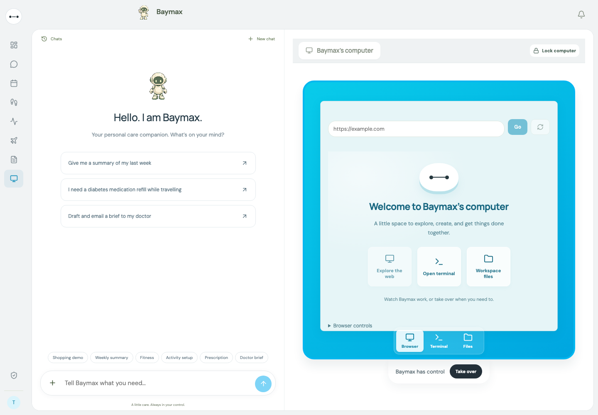
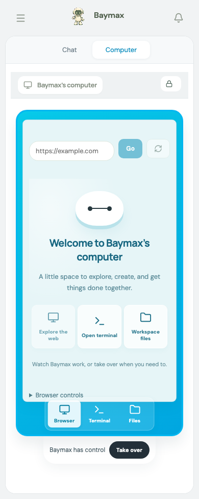

# Baymax’s computer

The Computer screen and Baymax’s `use-baymax-computer` tool share a persistent Chromium session and an isolated Linux workspace. Browser, Terminal, and Files are real operations. The integration adapts [OpenMuse](https://github.com/CopilotKit/openmuse) commit `b06caad7005ac5b6d2b451752a3794a6ae1759c1`; upstream MIT licenses and provenance are included in each service directory. Baymax keeps its existing Mastra agent, chat, and persistence.

## Start locally

Requires the app’s supported Node version, a running Docker engine, and Chromium for the worker. From the repository root:

```sh
npm ci
npm run computer:build
npm --prefix services/browser-worker ci
npm --prefix services/browser-worker exec -- playwright install chromium
```

Generate two different private keys with `openssl rand -hex 32`: one to unlock the computer, one to authenticate the worker. Put these server-only settings in your private `.env.local`:

```dotenv
BAYMAX_COMPUTER_ENABLED=true
BAYMAX_COMPUTER_ACCESS_KEY=<private computer access key>
BAYMAX_COMPUTER_ID=baymax-local
BAYMAX_COMPUTER_IMAGE=baymax-computer:local
BAYMAX_COMPUTER_DATA_DIR=/absolute/private/baymax-computer-data
BAYMAX_BROWSER_WORKER_URL=http://127.0.0.1:8790
BAYMAX_BROWSER_WORKER_TOKEN=<private worker token>
```

Start the worker in a separate terminal, supplying the matching worker token in its environment:

```sh
WORKER_TOKEN=<private worker token> WORKER_DATA_DIR=/absolute/private/browser-profiles npm run browser:worker
```

Restart `npm run agent:dev` so it loads the configuration, then start `npm run dev`. Open **Computer** in the app navigation and enter the computer access key. Access lasts an hour and survives navigation within this page. Reloading the page clears local access; **Lock computer** also revokes the server grant. Ask Baymax to browse a public page, prepare a text file, or calculate something in Python. Use Computer to watch its browser, inspect receipts, edit files, or take control.

If the backend uses another port, set `MASTRA_API_URL` as documented in the main README. Computer requests go through that proxy. Computer HTTP mutations require the UI origin; production deployments must set the exact `APP_ORIGIN` and use HTTPS.

## What the computer can do

- **Browser:** persistent public-web Chromium, address navigation, screenshots, clicks, text input, keys, scrolling, and page text. You and Baymax use the same session. Browser screenshots reach the model as images and are omitted from persisted tool cards. Private/local network destinations, non-HTTP protocols, credential-bearing URLs, nonstandard ports, WebSockets, and service workers are blocked by the reused worker. Its DNS-pinned egress proxy also checks subrequests and redirects.
- **Terminal:** bash, Python, Node, git, and core utilities inside a nonroot Docker container. The terminal has no network, credentials, host files, or Docker socket. It uses a read-only root, dropped capabilities, one CPU, 512 MiB memory, and 128-process limit. Each command runs for at most 30 seconds and returns up to 128 KiB of combined output. Timeouts/interruption stop the sandbox; the UI reports the receipt and stopped state. It never automatically repeats uncertain commands.
- **Files:** browse directories, create folders, and read/write UTF-8 text up to 256 KiB under `/workspace`. The helper refuses symlink traversal. Files persist in a named Docker volume across stops; browser profiles persist separately. This PR does not add general binary upload/download or a graphical desktop.

Command receipts contain commands and output and are stored in the configured private server directory. Operation IDs preserve duplicate-delivery and interrupted-outcome handling across server restarts. Keep both data directories private and back them up. Stopping the computer preserves files; deleting a volume or profile directory deletes its data.

This integration follows Baymax’s current single-owner deployment. Run one Mastra API process per computer deployment ID and data directory. The access key is an additional boundary for powerful computer tools, not a replacement for deployment authentication. Worker tokens never reach the client or model; the short-lived grant travels separately in request context and is redacted from traces. External page/file contents are untrusted evidence. Baymax’s instructions prohibit sending private health details, signing in, submitting forms, sending messages, purchases, or uploads without the user requesting that specific action.

## Verify

```sh
npm test
npm run build
npm run agent:build
npm run test:pwa
npm run test:computer
npm run test:computer:api
npm --prefix services/browser-worker run typecheck
```

Unit tests use synthetic providers; browser UI tests intercept the API. `test:computer` runs the actual container through isolation, persistence, symlink refusal, idempotency, interruption, output cap, and a real 30-second timeout. `test:computer:api` starts an actual Chromium worker and tests the private route handler together with the real terminal and Mastra tool: unlock, command, file read, public browsing, screenshots converted to model image parts, input, and revocation. Both real smoke scripts clean up their own containers, volumes, and temporary profiles. The API smoke needs the worker dependencies and Chromium installed. It does not call a live language model.



Desktop shared workspace using synthetic Playwright API fixtures. Real Docker and browser behavior is verified separately by the smoke tests.

## Shared workspace and control

The Computer screen keeps your conversation beside a cyan computer frame on desktop. On mobile, use the Chat/Computer switch. The dock opens the real browser, terminal, and workspace files. A Baymax welcome screen appears until a website is open. Browser previews refresh while the screen is visible; this is a shared screenshot view rather than a video desktop stream.

Baymax can operate the computer after you unlock it. Select **Take over** before using controls that change the browser, terminal, or files. The server interrupts pending agent mutations and waits for them to settle, then grants your session control. While you have control, agent mutations are rejected. Read-only browsing of status, screenshots and files remains available. **Return control** resumes agent access. Taking control does not restart a stopped sandbox or replay an interrupted command.

Manual control lasts five minutes and renews after new interaction while this view is open and focused. It expires after inactivity and is released when the owning session locks the computer. Other sessions can watch but cannot take an existing manual lease. Access expiry, server restarts and lease expiry require refreshing the displayed state. Use one Mastra API process, as required by the computer runtime.



Mobile view using the same synthetic Playwright API fixtures.
